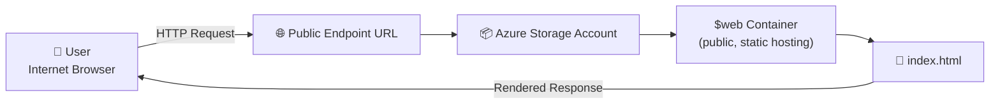

# 📷 Video Walkthrough
https://www.loom.com/share/1768e2774f74423ea7ebc5a82545c2ce

# ☁️ Lab 01 — Hosting a Static Website on Azure Blob Storage


A hands-on lab where I deployed a fully serverless, public-facing website using **Azure Blob Storage's static website hosting** feature — no VM, no web server, no maintenance.

---

## 📌 Overview

Most people's first instinct when they need to host a website is to spin up a server. This lab skips that entirely.

Instead, I used **Azure Blob Storage** in **PaaS (Platform as a Service)** mode — Azure handles the infrastructure, and I only had to worry about the content. This is the same pattern behind many real-world static sites, landing pages, and documentation portals.

| Detail | Value |
|---|---|
| **Difficulty** | Beginner |
| **Time to complete** | ~30 minutes |
| **Cloud Provider** | Microsoft Azure |
| **Core Service** | Azure Storage Account (Static Website Hosting) |
| **Cost** | Free Tier eligible |

---

## 🏗️ Architecture



**How it works:** A user's browser sends a request to the storage account's public endpoint. Azure routes that request into the special `$web` container, retrieves `index.html`, and returns it — all without a traditional web server in the middle.

---

## ✅ Prerequisites

- Active Azure subscription (Free Tier works)
- Basic text editor (VS Code, Notepad, etc.)
- Familiarity with the Azure Portal basics

---

## 🏷️ Naming Convention

| Resource | Name Used |
|---|---|
| Resource Group | `rg-lab01-reco` |
| Region | East US |
| Storage Account | `stlab01reco` |

> Storage account names must be **globally unique across all of Azure**, lowercase only, no special characters.

---

## 🚀 Deployment Steps

### 1. Create the Resource Group
Groups all lab resources together for easy management and cleanup.
```
Resource Groups → + Create → rg-lab01-reco → East US → Review + Create
```

### 2. Create the Storage Account
```
Storage Accounts → + Create
  Resource Group: rg-lab01-reco
  Name: stlab01reco
  Region: East US
  Performance: Standard
  Redundancy: LRS (Locally-Redundant Storage)
```

### 3. Enable Static Website Hosting
```
Storage Account → Data management → Static website → Enabled
  Index document name: index.html
  Error document path: 404.html
```
📎 Copy the **Primary Endpoint URL** generated here — that's the live site address.

### 4. Create the Web Page

```html
<!DOCTYPE html>
<html>
<head>
    <title>My First Cloud Site</title>
    <style>
        body { font-family: sans-serif; text-align: center; margin-top: 50px; background-color: #f0f0f0; }
        h1 { color: #0078d4; }
    </style>
</head>
<body>
    <h1>Hello from the Cloud!</h1>
    <p>This site is hosted on Azure Blob Storage.</p>
    <p>Deployed by: Reco</p>
</body>
</html>
```
Save as `index.html`.

### 5. Upload the File
```
Storage Account → Containers → $web → Upload → index.html
```

### 6. Validate
Visit the Primary Endpoint URL in a browser. You should see **"Hello from the Cloud!"**

---

## 🐛 Troubleshooting

| Issue | Cause | Fix |
|---|---|---|
| `404 - content does not exist` | File not named exactly `index.html` | Azure is case-sensitive — rename and re-upload |
| `404` (again) | Uploaded to wrong container | Confirm the file is in the **`$web`** container specifically |
| Storage account name rejected | Name already taken globally | Append random digits, e.g. `stlab01reco42` |

---

## 🧹 Cleanup

To avoid unnecessary cost, delete the resource group when finished:
```
Resource Groups → rg-lab01-reco → Delete resource group → confirm name → Delete
```

---

## 🔐 Security Notes

- Only the **`$web`** container is meant to be public — never enable public access on other containers in the same account.
- **LRS** is fine for a lab; production workloads should consider **GRS** for regional redundancy.
- The default endpoint is **HTTP only**. For production, put **Azure CDN** or **Front Door** in front of it for a custom domain and free HTTPS.
- Delete idle resources promptly — unused storage accounts are unnecessary attack surface.

---

## 📚 What I Learned

- Core differences between **IaaS** and **PaaS** hosting models
- How Azure Blob Storage's static website feature works under the hood
- Azure resource naming constraints and global uniqueness rules
- Basic cost-conscious resource cleanup practices

---

**Author:** Dereco Cherry
