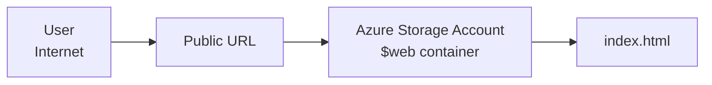

Creating A Static Website Using Azure
==============================
A public-facing resource in Azure. Using the concept of PaaS (Platform as a Service)

## What You'll Learn
- How to deploy a simple static website using the Azure platform without building out a server.
## Architecture

### Step 1 - We are going to create the Resource Group

> Why use Resource Groups? A resource group is like a folder or box that holds all the resources tied to your project. You can delete everything in one click, see costs for one resource group (Helpful if you have many), and apply permissions to a whole group instead of individual resources.

#### Phase 1: Create The Resource Group
  1. Log in to the Azure portal
  2. Type the name Resource group into the search bar at the top.
  3. Hit the + Create to create a new Resource group
  4. Type in your resource name: ex. rg-lab01
  5. Select the region that's near you.
  6. Click Review + Create
#### Phase 2: Create The Storage Account
  1. In the top Search bar, search for storage account.
  2. Click + Create
  3. On The Basics Tab:
     - Resource Group: Select the RG you created in Phase 1 ex. rg-lab01
     - Storage account name: Type in a unique name ex. stlab01[Your Name]
     - Primary Service: Choose Azure Blob Storage
     - Redundancy: Choose Locally redundant storage (LRS)
  4. Click Review + Create
  5. Click Create
#### Phase 3: Enable Static Website Hosting
  1. Click on the resource group you created in Phase 1, e.g., rg-lab01.
  2. You should see the storage account you created in Phase 2, e.g., stlab01
  3. Click the storage account. On the left side, you should see Data management.
  4. Click Static Website under it.
  5. Change Static Website to **enabled**.
  6. In the **Index document name** field, put in: index.html
  7. **Error document path** put in: 404.html (Optional but good practice)
  8. Click Save.
  9. Once saved, you should see a **primary endpoint** field. Copy down that address into Notepad. This is your new static website address. It should look similar to this (https://stlab01reco.z13.web.core.windows.net/)
#### Phase 4: Create your HTML file for your Website
  1. Open your text editor on your computer. I used VS Code but you can use the text editor of your choice.
     - Paste the following simple HTML code
      See the source: [index.html](./index.html)
      
3. Save this file on your desktop or somewhere you can find it as **index.html**
